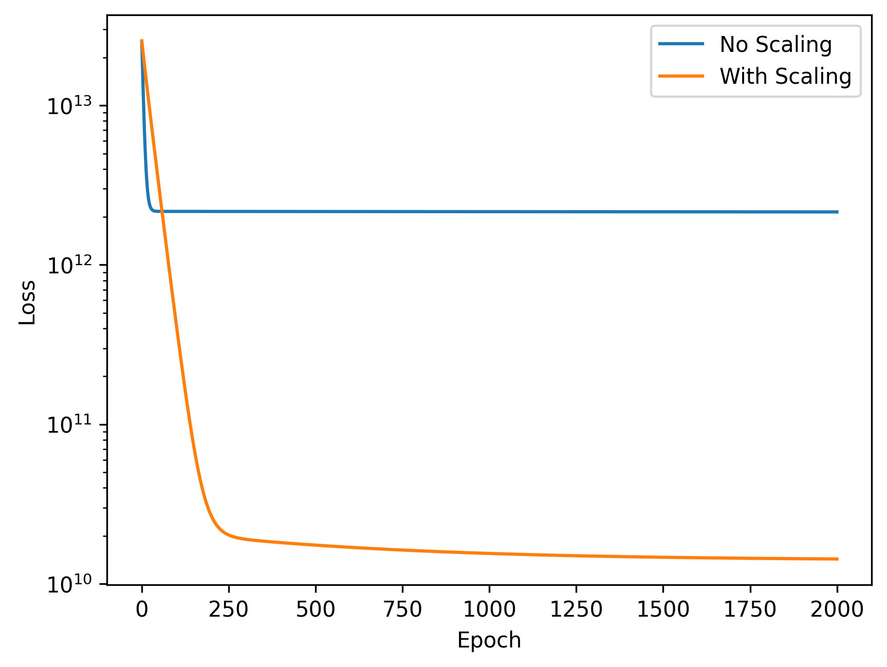

# Impact of Feature Scaling on Gradient Descent Convergence

This project demonstrates the critical impact of **Feature Scaling** on the convergence speed and stability of the **Gradient Descent** algorithm in Linear Regression.

##  Purpose of the Project
In machine learning, features often have vastly different scales (e.g., Number of Rooms [1-5] vs. Square Meters [50-400]). This project proves that:
* **Without scaling**, Gradient Descent is forced to use extremely small learning rates to avoid divergence.
* **With scaling**, the algorithm can use significantly higher learning rates safely, reaching the global minimum much faster.

##  Analysis & Visualization
The generated plot compares the **Loss (Cost)** reduction in both scenarios using a logarithmic scale:

### Key Observations:
1. **No Scaling (Blue Line):** Despite using a very small learning rate ($10^{-6}$), the model struggles to converge due to the magnitude gap between features.
2. **With Scaling (Orange Line):** Standardization allows for a much larger learning rate ($10^{-2}$), leading to a rapid drop in loss.

##  Technologies & Methods
* **Python**: Core programming.
* **NumPy**: Vectorized operations.
* **Matplotlib**: Visualization.
* **Manual Scaling**: Implemented Z-Score standardization ($z = \frac{x - \mu}{\sigma}$) manually.
